# GH-Gadgets By [Smiith](https://github.com/OwSmiithDev)

Gadgets SVG dinâmicos para README do GitHub — no espírito do `github-readme-stats`,
mas **sem nenhuma dependência**: só Node 18+ e a API GraphQL do GitHub.

Quatro cards:

| Endpoint | O que mostra |
|---|---|
| `/stats` | Tiles com estrelas, contribuições, seguidores, commits, PRs e issues |
| `/donut` | Anel segmentado à esquerda, legenda em pílulas à direita |
| `/langs` | Barra composta no topo, legenda em duas colunas embaixo |
| `/spread` | Em quantos repositórios cada linguagem aparece |

A legenda usa o **ícone real de cada linguagem**, embutido no SVG — nada é carregado
de fora. Veja a [seção 5](#5-ícones-das-linguagens).






---

## 1. Token do GitHub

A API GraphQL exige autenticação mesmo para dados públicos.

1. GitHub → **Settings → Developer settings → Personal access tokens → Tokens (classic)**
2. **Generate new token (classic)**
3. **Não marque nenhum escopo.** Um token sem escopo já lê tudo que é público — e se
   vazar, não dá acesso a nada.
4. Copie o valor (`ghp_...`).

Para incluir repositórios privados na contagem, marque `repo` — mas aí o token
vira um segredo sensível de verdade.

```bash
cp .env.example .env
# edite .env e cole o token em PAT_1
```

O limite do GraphQL é **5.000 pontos/hora por token**. Se o card ficar popular,
adicione `PAT_2`, `PAT_3`... de contas diferentes — o cliente faz rodízio automático
e tenta o próximo token quando um estoura o limite.

---

## 2. Rodar local

```bash
node server.js
# → http://localhost:3000/?username=SEU_USER
```

Preview sem token (dados falsos, só para ajustar o visual):

```bash
node scripts/preview.js                # tema obsidian → preview/
node scripts/preview.js paper          # tema claro
node scripts/preview.js obsidian docs  # grava noutra pasta
```

---

## 3. Deploy na Vercel

```bash
npm i -g vercel
vercel login
vercel link                 # ou `vercel` para criar o projeto
vercel env add PAT_1        # cole o token; marque ao menos Production
vercel --prod
```

Em **Framework Preset**, use **Node**. Não há build step e não há dependências.

O `package.json` fixa `engines.node` em `22.x`. A Vercel só oferece 20.x, 22.x e 24.x, e
uma faixa aberta deixaria a versão do deploy variar; localmente qualquer Node 18+ roda,
já que a única exigência é o `fetch` global.

```
https://seu-app.vercel.app/donut?username=SEU_USER
https://seu-app.vercel.app/stats?username=SEU_USER
https://seu-app.vercel.app/langs?username=SEU_USER
https://seu-app.vercel.app/spread?username=SEU_USER
```

### O entrypoint é o `server.js`

Com o preset Node, a Vercel captura o `server.js` da raiz — aquele que chama
`server.listen()` — e transforma ele na função do projeto. É **o mesmo servidor do
desenvolvimento local**: o que você testa em `localhost:3000` é literalmente o que roda
em produção, sem adaptador no meio e sem rewrites para manter em sincronia.

Por isso `server.js` não aparece no `.vercelignore`. Se um dia você renomear esse
arquivo, o deploy quebra com *"No entrypoint found"* — a Vercel procura por nome.

O `vercel.json` existe só para subir o `maxDuration` para 20s: a primeira requisição
sem cache pagina até 500 repositórios no GraphQL, e o teto padrão de 10s é apertado
para contas grandes.

### Cache

O handler devolve `s-maxage=1800, stale-while-revalidate=3600`. A Vercel consome esses
valores no CDN e envia só o `max-age` ao navegador — por isso a resposta mostra
`X-Vercel-Cache: HIT` a partir do segundo acesso, servindo em ~100ms enquanto revalida
em background.

### Lembre do camo

Deploy feito não significa card atualizado no seu perfil. O GitHub serve a imagem pelo
proxy `camo`, que cacheia por conta própria — veja a [seção 4](#4-usar-no-readme-do-perfil).
Para o seu próprio perfil, a rota B continua sendo a melhor escolha.

### Outras plataformas

A lógica toda vive em `src/handler.js`, que é agnóstico de framework e devolve
`{ status, headers, body }`. `server.js` é o adaptador para Node puro; Netlify
Functions, Cloudflare Workers e Deno Deploy pedem um equivalente de poucas linhas.

---

## 4. Usar no README do perfil

O README do perfil vive num repositório com **exatamente o mesmo nome do seu usuário**
(`SEU_USER/SEU_USER`), público, com um `README.md` na raiz. O GitHub mostra esse arquivo
no topo do seu perfil.

Existem duas rotas. A diferença entre elas é o cache do camo.

### Rota A — imagem apontando para a Vercel

```markdown


```

A função roda a cada visita e devolve dados frescos. **Mas o GitHub não carrega
imagens externas direto** — ele passa tudo pelo proxy `camo`, que cacheia por conta
própria. Na prática o card pode ficar horas mostrando números velhos, e não existe
como forçar a atualização do seu lado. É a limitação mais reclamada de todos os
projetos desse tipo.

Vantagem: outras pessoas podem usar sua URL com o `username` delas.

### Rota B — Actions commitando o SVG no repositório

Aqui o card vira um **arquivo dentro do próprio repo**. O camo some da jogada: o GitHub
serve arquivos do repositório direto, e um `git push` invalida o cache na hora.

```markdown


```

Montagem:

1. Copie `scripts/`, `src/` e `package.json` para dentro do repositório
   `SEU_USER/SEU_USER`, e `templates/cards.yml` para
   `.github/workflows/cards.yml` **lá**.

   O workflow mora em `templates/` aqui de propósito: neste repositório `assets/`
   é ignorado (é saída de teste), e o passo `git add assets/` sairia com código 1,
   deixando o Actions vermelho sem motivo. No repositório do perfil `assets/` é
   versionado, e aí o mesmo arquivo funciona.
2. **Settings → Secrets and variables → Actions → New repository secret**
   → nome `PAT_1`, valor do seu token.
3. **Settings → Actions → General → Workflow permissions** → marque
   *Read and write permissions*. Sem isso o passo de commit falha com 403.
4. Aba **Actions → Atualizar cards → Run workflow** para rodar a primeira vez.

Depois disso roda sozinho duas vezes por dia. Ajuste o `cron` no workflow se quiser
outra frequência — mas lembre que o Actions desativa workflows agendados em
repositórios sem commits há 60 dias (o próprio commit dos cards já resolve isso).

Testar localmente antes de commitar:

```bash
node scripts/render.js --user=SEU_USER --out=assets --donut="count_mode=repo"
node scripts/render.js --user=SEU_USER --mock=true --out=assets   # sem token, dados falsos
node scripts/render.js --user=SEU_USER --out=assets --width=560   # todos mais estreitos
```

As flags do `render.js` são o espelho dos parâmetros de query da rota A:
`--theme`, `--locale`, `--width`, `--hide_border`, `--disable_animations`, `--suffix`,
e `--donut=` / `--langs=` para os parâmetros específicos de cada card
(`--donut="count_mode=repo&center=code&card_width=900"`).

**Qual escolher:** se o card é só seu, rota B. Se você quer publicar como serviço
para outras pessoas usarem, rota A.

### Tamanho

Os três cards saem com 760px de largura, o que já é mais do que a coluna de leitura
do GitHub. Lado a lado eles quebram no celular — prefira um por linha e controle a
escala pelo `width` da tag:

```html

```

Se quiser mesmo dois na mesma linha, gere-os estreitos com `card_width=520` na rota A,
ou passe `--donut="card_width=520"` no `render.js`.

### Tema claro e escuro automático

O `<picture>` troca a imagem conforme o tema do GitHub de quem está lendo:

```html
<picture>
  <source media="(prefers-color-scheme: dark)"  srcset="./assets/donut.svg">
  <source media="(prefers-color-scheme: light)" srcset="./assets/donut-light.svg">
  
</picture>
```

Para gerar o par, rode o render duas vezes com temas diferentes:

```bash
node scripts/render.js --user=SEU_USER --out=assets --theme=obsidian
node scripts/render.js --user=SEU_USER --out=assets --theme=paper --suffix=-light
```

---

## 5. Ícones das linguagens

A legenda do `/donut` e do `/langs` mostra o ícone real de cada linguagem, vindo de
[tandpfun/skill-icons](https://github.com/tandpfun/skill-icons) (MIT). Linguagem sem
ícone correspondente cai num quadrado na cor dela — a legenda nunca fica com buraco, e
os dois marcadores ocupam a mesma caixa, então a coluna de texto continua alinhada
mesmo numa legenda misturando os dois casos.

A variante `-Dark` ou `-Light` é escolhida pela luminância do fundo do card, calculada
em vez de fixada no tema: se você sobrescrever `bg_color` para uma cor clara, os ícones
acompanham.

### Por que os ícones vivem dentro do repositório

`src/render/icon-data.js` é um arquivo **gerado**, com cada ícone em base64. Parece
redundante — por que não apontar para a URL do skill-icons? Três motivos:

1. **SVG exibido via `` não carrega recurso externo.** É assim que o GitHub
   renderiza o card. Um `<image href="https://...">` dentro dele simplesmente não
   aparece. O ícone precisa viajar dentro do próprio arquivo.
2. **`data:` URI isola cada ícone.** 23 dos 94 ícones que este projeto vendoriza — 156
   dos 402 do repositório original — usam ids de gradiente gerados pelo Figma
   (`paint0_linear_...`), que colidiriam entre si se fossem inlinados como SVG aninhado
   no mesmo documento.
3. **Funciona em qualquer runtime.** Um módulo JS carrega igual em Vercel, Workers, Deno
   e no Actions, sem `fs` e sem configuração de bundling.

O custo é peso: cada ícone soma ~2–5 KB ao card. Um `/donut` com seis linguagens fica
em torno de 30 KB — a mesma ordem de grandeza dos cards do `github-readme-stats`.

### Atualizar ou adicionar uma linguagem

O mapa `linguagem do GitHub → arquivo do skill-icons` fica em
`src/render/icon-map.js`, e é a fonte de verdade: o script baixa exatamente o que
está nele, e nada mais.

```bash
node scripts/fetch-icons.js              # regrava src/render/icon-data.js
ICONS_REF=v1.2.0 node scripts/fetch-icons.js   # fixa uma tag/commit do skill-icons
```

Os nomes raramente batem, o que é justamente o motivo de existir um mapa explícito:

| GitHub chama de | skill-icons chama de |
|---|---|
| `Go` | `GoLang` |
| `C++` | `CPP` |
| `C#` | `CS` |
| `Shell` | `Bash` |
| `SCSS` | `Sass` |
| `Vue` | `VueJS` |

Algumas linguagens não têm ícone próprio, mas a ferramenta dona delas tem — o mapa usa
essa saída quando ela é honesta: `Dockerfile` → Docker, `HCL` → Terraform (HCL é a
linguagem do Terraform), `PLpgSQL` → PostgreSQL, `Blade` → Laravel.

---

## 6. Parâmetros

### Comuns a todos os cards

| Parâmetro | Padrão | Descrição |
|---|---|---|
| `username` | — | **Obrigatório.** Login do GitHub |
| `theme` | `obsidian` | `obsidian`, `paper`, `contel`, `dracula`, `nord` |
| `custom_title` | — | Substitui o título |
| `hide_title` | `false` | Remove o título |
| `hide_border` | `false` | Remove a borda |
| `disable_animations` | `false` | Desliga o fade-in |
| `card_width` | `760` | Largura em px. Os três cards aceitam 520–1100 |
| `locale` | `pt-BR` | `pt-BR` usa vírgula decimal; `en` usa ponto |
| `cache_seconds` | `1800` | Entre 1800 e 86400 |

Cores individuais (hex sem `#`) sobrescrevem o tema:
`bg_color`, `surface_color`, `border_color`, `text_color`, `muted_color`, `title_color`.

```
/donut?username=smiith&theme=contel&title_color=FF7A18&hide_border=true
```

### `/stats`

| Parâmetro | Padrão | Descrição |
|---|---|---|
| `hide` | — | Lista separada por vírgula: `stars,commits,contributions,prs,issues,followers` |
| `columns` | `3` | 1, 2 ou 3 colunas de tiles |

### `/donut` e `/langs`

| Parâmetro | Padrão | Descrição |
|---|---|---|
| `langs_count` | `6` | Quantas linguagens listar (1–10) |
| `exclude_langs` | — | Ex.: `html,css,scss` |
| `count_mode` | `bytes` | `bytes` = peso de código real; `repo` = 1 voto por repositório (linguagem principal) |
| `show_others` | `false` | Acrescenta a fatia "Outras" com a cauda longa. Sem ela, os percentuais das linguagens mostradas renormalizam para somar 100% |
| `hide_archived` | `false` | Ignora repositórios arquivados |

Exclusivos do `/donut`:

| Parâmetro | Padrão | Descrição |
|---|---|---|
| `center` | `repos` | O que aparece no centro: `repos`, `code` (repos com linguagem detectada), `stars`, `contributions` |
| `center_label` | auto | Texto sob o número |
| `ring_width` | `26` | Espessura do anel (8–40) |

### `/spread`

| Parâmetro | Padrão | Descrição |
|---|---|---|
| `langs_count` | `6` | Quantas linguagens listar (1–10) |
| `exclude_langs` | — | Ex.: `html,css,scss` |
| `hide_archived` | `false` | Ignora repositórios arquivados |
| `min_share` | `5` | Fração mínima dos bytes do repositório para a linguagem contar (0–50) |

`show_others` **não** se aplica aqui: não há um todo a completar. Veja
[seção 7](#o-que-o-spread-mede).

**Dica sobre `count_mode`:** por bytes, um único repositório grande domina o gráfico —
um projeto com muito CSS minificado vira "CSS developer". `count_mode=repo` conta uma
unidade por repositório e costuma refletir melhor o que a pessoa realmente escreve.

```
/donut?username=smiith&count_mode=repo&exclude_langs=html,css&center=code
```

---

## 7. Como os números são calculados

- **Estrelas** — soma dos `stargazerCount` dos repositórios próprios, forks excluídos.
- **Repositórios** — `totalCount` de repositórios **próprios e não-fork**. Não bate com
  o número do perfil, que inclui forks.
- **Contribuições** — total do calendário dos últimos 12 meses.
- **Commits** — commits do ano corrente + `restrictedContributionsCount` (contribuições
  em repositórios privados, contadas sem revelar o conteúdo).
- **Issues** — abertas + fechadas.
- Paginação para até 500 repositórios (5 páginas de 100).

### O que o `/spread` mede

Os outros cards respondem "quanto código" (`/langs`, por bytes) e "quantos repositórios
têm essa linguagem como principal" (`/donut` com `count_mode=repo`). O `/spread` responde
uma terceira coisa: **em quantos repositórios a linguagem aparece**, seja ela principal
ou não.

As três divergem de verdade. Num perfil real:

| | bytes | principal em | presente em |
|---|---|---|---|
| TypeScript | **62,0%** | 3 | 3 de 8 |
| JavaScript | 22,8% | 2 | **6 de 8** |
| CSS | 1,7% | **0** | 4 de 8 |

CSS está em metade dos repositórios e **não aparece em nenhum outro card**, porque nunca
é a linguagem principal. O ranking por bytes tem a distorção oposta: um repositório com
SVGs grandes pode colocar "SVG" em primeiro lugar.

**Cada barra é independente**, de 0 a 100% dos repositórios. Uma linguagem conta em vários
repositórios ao mesmo tempo, então a soma passa de 100% — é por isso que este card usa
barras separadas em vez de anel ou barra composta. As duas outras formas afirmam
visualmente "isto soma 100%", e aqui seria mentira.

Dois detalhes do denominador e do corte:

- O total conta só repositórios com **código detectável**. Repositórios vazios inflariam
  o denominador e fariam toda barra parecer menor do que é.
- `min_share` evita chamar de "usa a linguagem" um arquivo de reset solto. O padrão de 5%
  muda bastante o retrato: sem limiar, um perfil que testei mostra CSS em 36 repositórios;
  com 5%, em 20. Use `min_share=0` para presença pura.

Limite conhecido: a query pede `languages(first: 12)` por repositório. Uma 13ª linguagem
minúscula num repo não é contada.

Cache em duas camadas: memória do processo (30 min) e `Cache-Control` com
`stale-while-revalidate`, que faz o CDN servir o card instantaneamente enquanto
regenera em background.

---

## 8. Estrutura

```
src/
  github.js              cliente GraphQL, rodízio de tokens, paginação
  stats.js               agregação: estrelas, linguagens por bytes ou por repo
  handler.js             parsing de query, roteamento, cache, card de erro
  colors.js              paleta do Linguist + fallback determinístico
  utils.js               escape XML, formatação, medição de texto
  render/
    themes.js            tokens de cor + luminância do fundo
    card.js              casca comum (borda, título, animações)
    legend.js            legenda compacta + markerFor(), o ícone com fallback
    glyphs.js            GERADO: glifos do Octicons (estrela, commit, PR…)
    icon-map.js          linguagem do GitHub → arquivo do skill-icons
    icon-data.js         GERADO: ícones de linguagem em base64
    stats-card.js
    donut-card.js        ← o card assinatura
    langs-card.js
    spread-card.js       alcance: em quantos repos cada linguagem aparece
server.js                servidor local — e o entrypoint na Vercel
scripts/preview.js       render com dados falsos, sem token
scripts/render.js        CLI que grava os SVGs em disco (usado pelo Actions)
scripts/fetch-icons.js   baixa os ícones e regrava icon-data.js
scripts/mock-data.js     dados falsos compartilhados
templates/cards.yml      workflow para copiar ao repo do perfil
vercel.json              maxDuration da função
docs/                    imagens de exemplo deste README
```

## 9. Adicionar um card novo

1. Crie `src/render/meu-card.js` exportando uma função que devolve string SVG.
   Use o helper `card()` para a casca — assim herda borda, título e animações.
   Para o marcador de uma linguagem use `markerFor()` (`src/render/legend.js`),
   que resolve ícone com fallback para quadrado colorido; para glifos de interface,
   `glyph()` (`src/render/glyphs.js`).
2. Registre o tipo em `handle()` (`src/handler.js`).
3. Acrescente a rota em `server.js`, no conjunto `KINDS`.

## Notas de design

- **Assinatura:** o anel usa gaps reais de 4px entre segmentos. Repositórios são
  unidades discretas, não uma proporção contínua — o gráfico trata cada linguagem
  como peça separável em vez de fatia de pizza. A legenda em pílulas repete a ideia:
  cada linguagem é um bloco, não uma linha de uma lista.
- **Cor identifica, não necessariamente se lê.** O amarelo do JavaScript tem 1,16:1
  de contraste sobre fundo claro. Onde a cor da linguagem vira **texto**, ela passa
  por `readableOn()` (`src/colors.js`), que puxa a luminosidade até 4,5:1 mantendo o
  matiz. Ícones, pontos e barras seguem com a cor original — não são texto e não
  precisam do mesmo limite.
- **Marcador de largura fixa:** ícone e quadrado colorido ocupam a mesma caixa. Uma
  legenda que mistura os dois — porque nem toda linguagem tem ícone — mantém a coluna
  de texto alinhada, em vez de serrilhar.
- **O brilho do anel só existe no tema escuro.** No claro ele vira sujeira cinzenta.
  Quem decide é `isDarkTheme()`, pela luminância do fundo — não pelo nome do tema,
  para que um `bg_color` sobrescrito também acerte.
- **O rodapé mostra a data, não "agora".** O SVG fica commitado no repositório;
  "atualizado agora" seria mentira uma hora depois.
- As animações usam `animation-fill-mode: backwards`, não `forwards` com
  `opacity: 0`. Em qualquer renderizador que ignore CSS animation, o card aparece
  completo em vez de invisível.
- `prefers-reduced-motion` desliga o movimento.
- Todo hex vem de `render/themes.js`. Nenhuma cor nasce dentro de um render.

---

## Créditos

- Ícones das linguagens: [tandpfun/skill-icons](https://github.com/tandpfun/skill-icons) — MIT
- Glifos de interface: [primer/octicons](https://github.com/primer/octicons) — MIT
- Cores das linguagens: paleta do [Linguist](https://github.com/github-linguist/linguist) — MIT
- Inspiração: [anuraghazra/github-readme-stats](https://github.com/anuraghazra/github-readme-stats)
